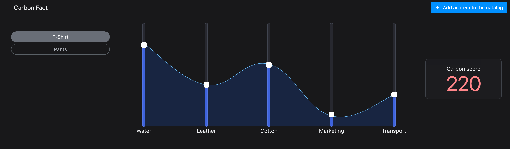

# Carbon fact

Stack used:

- NextJS
- NestJS
- Prisma
- sqlite

# Quick start

### Frontend

```
# install frontend dependencies
cd apps/front
npm install
```

### Backend

```
# install backend dependencies
cd apps/back
pnpm install
# Install & seed DB
npx prisma db push && npx prisma db seed
```

### Frontend Execution

```
cd apps/front && npm run dev
```

### Backend Execution

```
cd apps/back && npm run start:dev
```

Open `localhost:3000`



# Testing

### Back Unit testing

`npm run test`

### Backend integration testing

`npm run test:e2e`
